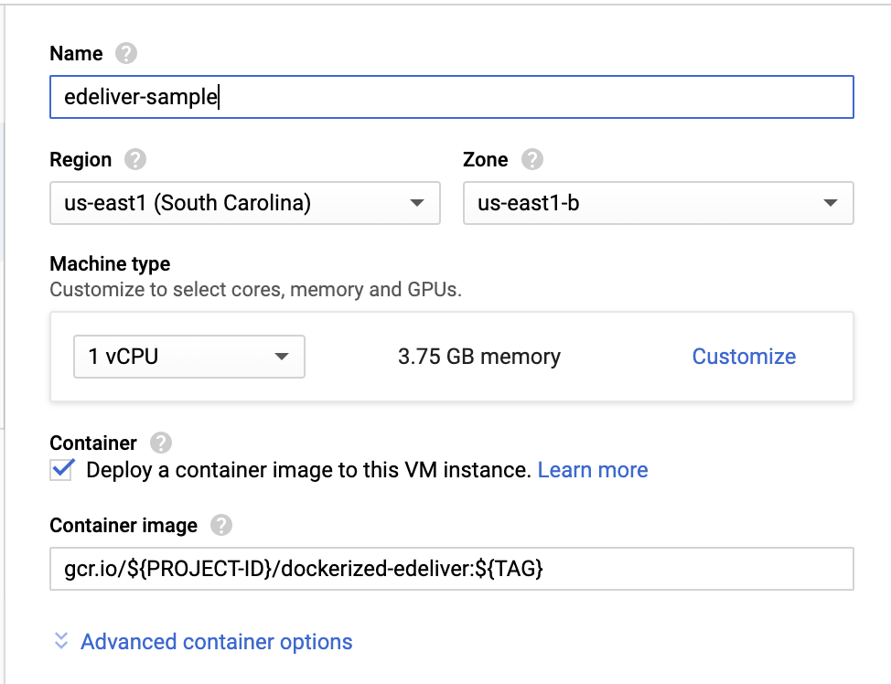

# Dockerized Edeliver
Some cloud providers allow a docker image to be used as the base for a VM.  Dockerized [edeliver](https://github.com/edeliver/edeliver) capitalizes on that by simplifying the set up of edeliver on your servers.  This is done by building a local docker image that is edeliver enabled and deploying it to all of your VMs as their base image.

Here are the steps to use this Docker image to set up edeliver on your server.

## Prerequisites
### Clone this repository
You will need a local version of this repository.  Clone it by running:
```bash
  git clone https://github.com/LukeWood/dockerized-edeliver
```
### Generating an RSA Key
First, you need to make sure you have a [public rsa key](https://www.ssh.com/ssh/public-key-authentication) that you will use to connect to your [edeliver](https://github.com/edeliver/edeliver) enabled servers.

If you don't, you can easily generate on with [ssh-keygen](https://www.ssh.com/ssh/keygen/).

run:
```bash
ssh-keygen
```

I recommend *not* using a [key phrase](https://www.ssh.com/ssh/passphrase) for the rsa key used here.  This is to keep edeliver fully automated.

## Image building
### Adding RSA Key to the Docker Image.
Next copy the docker image to the [assets/tmp/id_rsa](assets/tmp/id_rsa) path of your local version of This git repo.

```bash
  cd dockerized-edeliver
  cp ~/.ssh/id_rsa assets/tmp/id_rsa
```

### Build the image
Next run the [docker](https://www.docker.com/) build command and tag the image however you need to.

```
  docker build . -t dockerized-edeliver
```

## Deploying your edeliver enabled server
Now your image is ready to go and can be deployed to a cloud provider.
If there is an option of how the Docker image is run make sure to specify the `--network host` flag.

### gcr.io
To use the image on Google Cloud you should push the docker image to gcr.io.

First you will need to tag the image.
```bash
  docker tag dockerized-edeliver gcr.io/${PROJECT-ID}/dockerized-edeliver:${TAG}
  docker push gcr.io/${PROJECT-ID}/dockerized-edeliver:${TAG}
```

Then when you go to create your VM make sure to select your dockerized-edeliver image.

